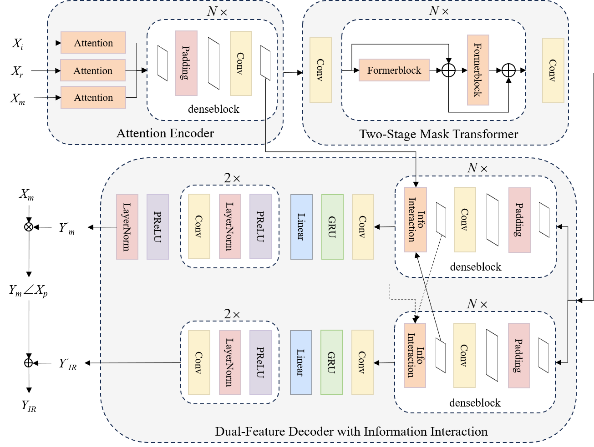

# TSMGAN-II
《TSMGAN-II: Generative Adversarial Network Based on Two-Stage Mask Transformer and Information Interaction for Speech Enhancement》

This is the repository for our paper (ICIC2024).

## File

```shell
TSMGAN-II
    AudioData.py # Define the dataset class
    checkpoint.py # Define the checkpoint class
    config.py # Define the training environment
    discriminator.py # Define the discriminator
    eval_composite.py # Define the function for the composite score 
    generator.py # Define the generator class
    model_trainer.py # Define training method
    utils.py # Define utils function
Dataset
    generalization_experiment # Dataset for generalization experiment  
conference_accepted.pdf # Final conference Paper
```

## Overview



Speech Enhancement is significantly applied in speech processing, as  a foundation for downstream tasks. Nowadays, neural networks are well applied  in speech enhancement. However, there remain considerable difficulties for neural networks to improve speech quality. Firstly, existing methods have the problem of speech over-suppression. Because they have not yet taken into account  that neural networks influence not only background noise but also clean speech  during enhancement. This issue can negatively impact the following tasks. Secondly, striking a balance between model complexity and performance is crucial,  especially when deploying on resource-constrained hardware. Existing models  often prioritize performance, overlooking the issue of complexity. To solve the  problems above, we propose a novel Generative Adversarial Network based on  Two-Stage Mask Transformer and Information Interaction (TSMGAN-II), consisting of an attention encoder, a two-stage mask transformer, and a dual-feature  decoder with information interaction. It effectively captures and models both amplitude and spectral characteristics within the time-frequency domain. Experiments on the VoiceBank+DEMAND dataset show that our model, with 1.39 million parameters, achieves state-of-the-art performance with PESQ of 3.40 and  SSNR of 11.81. Moreover, we also introduce a lightweight model with just 0.59M parameters, achieving 97% of the performance of SOTA models with  PESQ of 3.31 and SSNR of 11.53. 

## Environment
As of August 2024, the latest version is fine.
```
pytorch
numpy
tqdm
scipy
h5py
pesq
pystoi
```

## Dataset

### VoiceBank+Demand dataset

Download from https://datashare.ed.ac.uk/handle/10283/2791

### Dataset for generalization experiment (uploaded)

In the generalization experiment, we constructed three test sets to evaluate the  model performance for varying noise conditions. 

1. **Dataset for noise environment matching**: It comprises 800 clean utterances from the VoiceBank+DEMAND test set, combined with 4 unseen noises (DLIVING, OMEETING, SPSQUARE, TBUS  noise) from the DEMAND dataset. 
2. **Dataset for noise environment mismatch**: It includes the same 800 clean utterances, mixed with two unseen noises (factory1 and  babble noise) from the NOISEX-92 dataset3. 
3. **Dataset for channel environment mismatch**: It contains 800 clean utterances from TIMIT4 , mixed with two unseen noises (factory1 and babble noise). 

Each dataset is mixed at SNRs of 0, 6, 12 and 18 dB with 200  utterances per SNR level. 

## How to start

1. Download VoiceBank+Demand dataset.
2. Organise every noisy speech and its according clean speech in a single file using h5py.
3. Set configuration: `config.py`
   1. Dataset path
   2. Model resume path
4. Run `python model_trainer.py`
